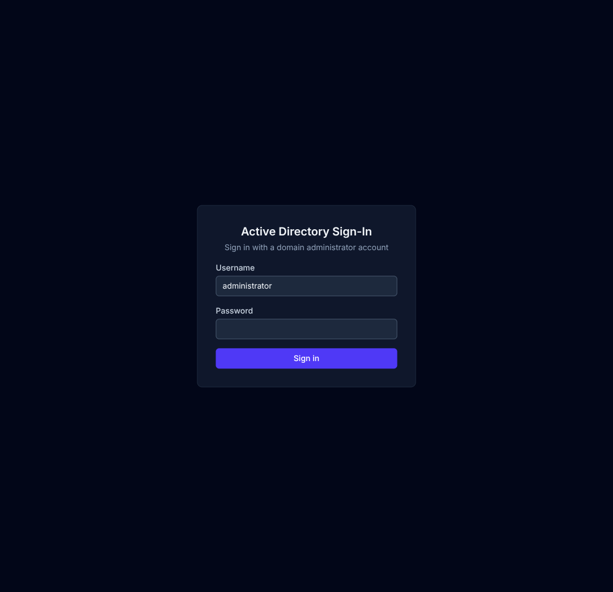
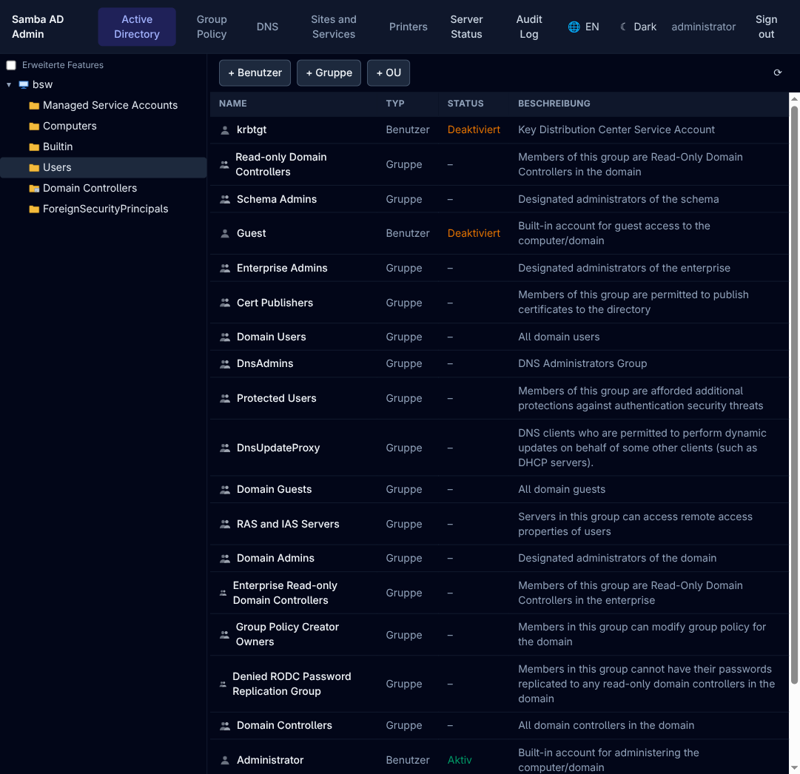
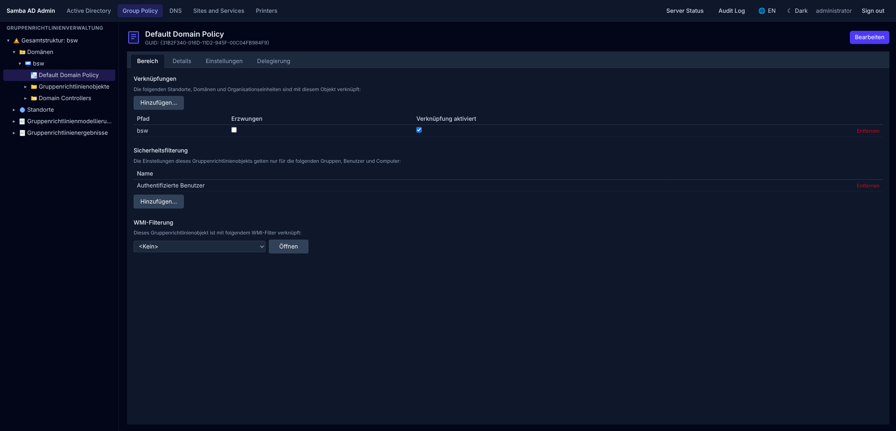
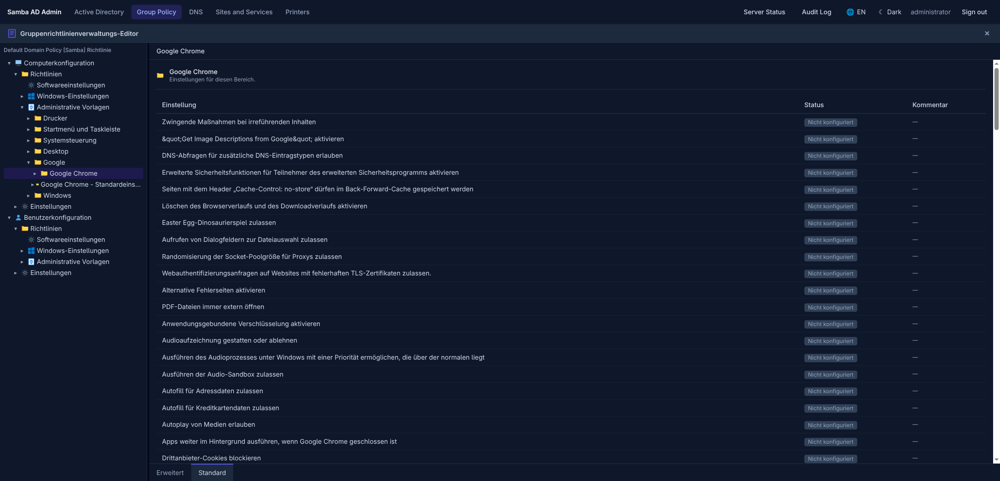
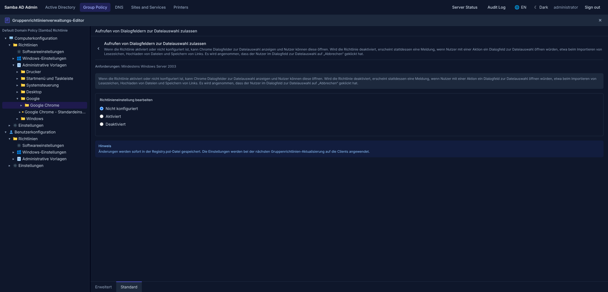
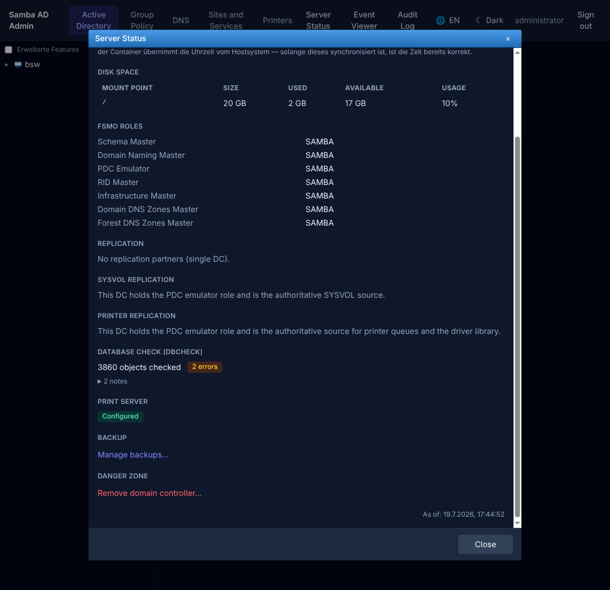
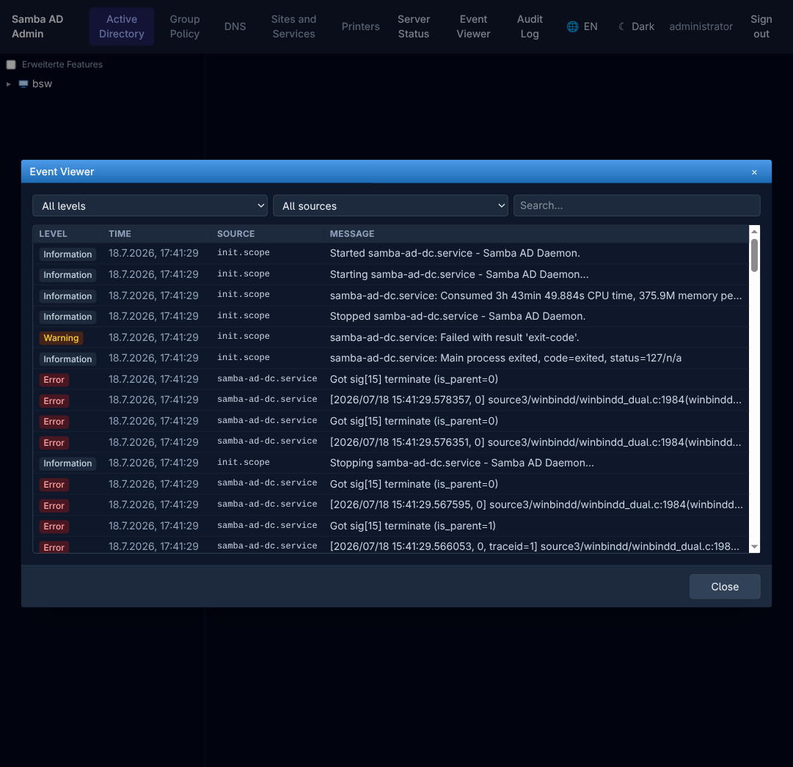
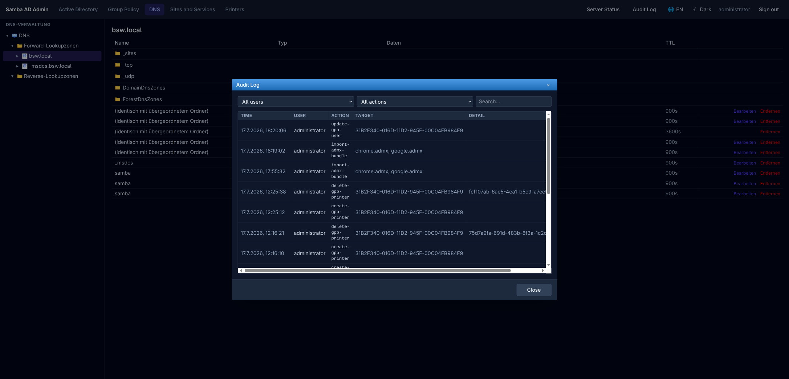

# Samba AD-DC Web Admin

A browser-based admin console for a [Samba](https://www.samba.org/) Active
Directory Domain Controller. It turns a bare Debian/Ubuntu server into a
fully provisioned AD DC via a setup wizard, then gives you a web UI that
mirrors the real Windows Server admin tools — **Active Directory Users and
Computers**, **Group Policy Management Console**, the **DNS Manager**, and a
CUPS-backed print server with Windows driver distribution via Group Policy —
so anyone who has used Windows Server can drive it without a manual.

No Windows machine, no RSAT, no separate management host: it runs as a
single systemd service directly on the domain controller.

## Screenshots

| | |
|---|---|
|  |  |
| Sign-in | Active Directory — Users and Computers |
|  |  |
| Group Policy Management — scope, security filtering, links | Group Policy Editor — third-party ADMX templates (Chrome) imported and fully translated |
|  |  |
| Group Policy Editor — editing a single policy | Server health — FSMO roles, replication, dbcheck, backup, remove-DC |
|  |  |
| Event Viewer — the Samba/CUPS system journal, filterable by level and source | Audit log of every administrative action |

## Why

Samba can run the AD DC role just fine, but administering it usually means
`samba-tool` one-liners or editing `.pol`/`smb.conf` files by hand — there's
no equivalent of the Windows Server admin experience. This project closes
that gap: wherever a real Windows Server tool exists, this app aims to be an
exact functional match for it, not a reinvention.

## Features

- **Setup wizard** — package install (Debian/Ubuntu detected automatically),
  preflight checks (DNS port conflicts, hostname sanity, time sync,
  firewall), and three provisioning modes driven entirely from a browser:
  create a new forest (`samba-tool domain provision`), **join an existing
  domain** as an additional, replicating DC, or **restore a domain from a
  backup file** onto a fresh server (disaster recovery).
- **Remove a domain controller** — a "DCPROMO uninstall" equivalent: checks
  it's safe to remove (refuses on the last DC in the domain), demotes it out
  of the domain, and returns the box to a bare, re-provisionable state.
- **Full domain backup/restore** — `samba-tool domain backup online` on
  demand from the server health dashboard, downloadable, and feedable back
  into the setup wizard's restore mode to rebuild a domain from scratch
  after total DC loss.
- **DC-to-DC replication for this app itself** — SYSVOL and print-server
  configuration (CUPS queues, uploaded Windows drivers) automatically mirror
  across every DC running this app, so a promoted replica is fully
  self-sufficient, not just AD-replicated.
- **Active Directory Users and Computers equivalent** — users, groups
  (including nested membership), organizational units, computer accounts,
  fine-grained password policies (PSOs), domain/forest trusts.
- **Group Policy Management Console equivalent** — GPO create/copy/backup/
  restore, links and scope (security filtering, WMI filters, enforced/
  disabled), delegation, RSoP-style modeling, and full Administrative
  Templates support against the real ADMX/ADML Central Store, including a
  wizard to **import third-party ADMX bundles** (Chrome, Adobe, ...) —
  something not even GPMC's modern UI offers directly.
- **Group Policy Preferences** — registry, scripts, drive maps, scheduled
  tasks, power options, environment variables, shortcuts, files, folders,
  INI files, local users/groups, folder options, regional options, start
  menu, network options, data sources, devices, Internet settings, network
  shares, services, and printers — each editable the way GPME edits them.
- **DNS Manager equivalent** — forward/reverse lookup zones, records,
  forwarders.
- **AD Sites and Services equivalent** — sites, subnets, site links.
- **Print server** — CUPS-backed print queues, Windows driver upload, and
  driver distribution via Group Policy Preferences, with a picker that
  resolves printer hostnames to IPs (DNS, falling back to NetBIOS) for the
  GPO printer connection dialogs.
- **Server health dashboard** — FSMO role holders, replication status,
  `dbcheck`, disk usage, time sync, print server state, SYSVOL/print sync
  status, plus one-click backup and DC removal.
- **Event Viewer equivalent** — the Samba/CUPS system journal (samba-ad-dc,
  smbd, nmbd, winbind, cups), filterable by severity.
- **Audit log** of every administrative action taken through the app.

## Architecture

- **Backend**: Node.js/TypeScript (Express), driving `samba-tool`, `ldbsearch`,
  CUPS (`lpadmin`/`lpoptions`/...), and `rpcclient` as subprocesses through a
  single allowlisted execution chokepoint — the frontend can never reach an
  arbitrary shell command.
- **Frontend**: React/TypeScript, built to mirror the actual Windows admin
  tool it replaces (MMC-style tree + list panes, modal property sheets)
  rather than reinventing the UX.
- **Deployment**: ships as a single self-contained executable (Node
  [Single Executable Application](https://nodejs.org/api/single-executable-applications.html))
  plus a static asset folder — **no Node.js or npm required on the target
  server**, no internet access needed there either. See
  [`docs/install.md`](docs/install.md).

## Quick start

```sh
git clone <this-repo> samba-admin-webapp
cd samba-admin-webapp
npm install
npm run build
bash packaging/build-binary.sh   # produces dist/samba-admin-webapp-<version>-linux-x64.tar.gz
```

Copy the resulting tarball to a fresh Debian/Ubuntu server, extract it, and run:

```sh
sudo bash packaging/install.sh
```

Then open `https://<server-ip>:8443` and follow the wizard. Full details,
requirements, and what the wizard does at each step are in
[`docs/install.md`](docs/install.md).

## Development

```sh
npm install
npm run dev:backend    # backend against a real or test Samba DC, see backend/src/config.ts
npm run dev:frontend   # Vite dev server
```

`npm run typecheck` and `npm run build` run across all three workspaces
(`shared`, `backend`, `frontend`).

## License

MIT — see [LICENSE](LICENSE).
